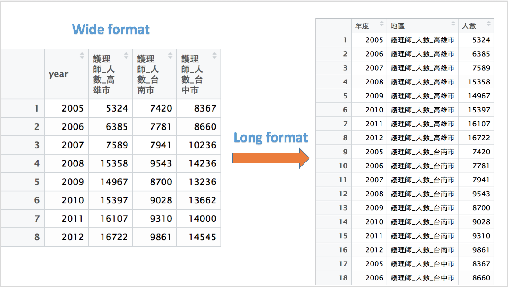

```{r ,echo=FALSE,warning=FALSE,message=F}
options('scipen'=100,'digits'=2)
knitr::opts_chunk$set(comment="",prompt=F,strip.white=F,warning=FALSE,message=F,echo=F,comment="")
library(dplyr)
library(dygraphs)
library(ggplot2)
library(ggmap)
library(data.table)
library(devtools)
library(plotly)
library(xtable)
library(rCharts)
library(tidyr)
library(DT)
library(RColorBrewer)
###############
  multiplot <- function(..., plotlist=NULL, file, cols=1, layout=NULL) {
    library(grid)
    
    # Make a list from the ... arguments and plotlist
    plots <- c(list(...), plotlist)
    
    numPlots = length(plots)
    
    # If layout is NULL, then use 'cols' to determine layout
    if (is.null(layout)) {
      # Make the panel
      # ncol: Number of columns of plots
      # nrow: Number of rows needed, calculated from # of cols
      layout <- matrix(seq(1, cols * ceiling(numPlots/cols)),
                       ncol = cols, nrow = ceiling(numPlots/cols))
    }
    
    if (numPlots==1) {
      print(plots[[1]])
      
    } else {
      # Set up the page
      grid.newpage()
      pushViewport(viewport(layout = grid.layout(nrow(layout), ncol(layout))))
      
      # Make each plot, in the correct location
      for (i in 1:numPlots) {
        # Get the i,j matrix positions of the regions that contain this subplot
        matchidx <- as.data.frame(which(layout == i, arr.ind = TRUE))
        
        print(plots[[i]], vp = viewport(layout.pos.row = matchidx$row,
                                        layout.pos.col = matchidx$col))
      }
    }
  }
ubike <- read.csv('ubikebyhourutf8/ubike-hour-201502-utf8.csv') 
temp <- read.csv("歷年護理人員資料.csv")  #請輸入正確的檔案路徑
```

# Speaker

## About me 

<center>
</img>
</center>


- ### Alger Yang, M.S,政大統計所碩二
- 角色：
    - 資料分析**屍**
    - 資料視覺化愛好者
    - 健保資料庫的掃地工人(資料清理...)
- 常用工具：
    - R、SQL、SPSS
- 目前工作：
    - DSP講師
    - 健保資料庫資料分析
    - 政大風管所法律組量化資料分析研究助理


# 課程綱要

## Agenda 

>- Data Visualization
>- ggplot in R
    - 介紹
    - 架構
    - 起手式(基本語法)
    - 應用(各種圖形的呈現)
        + Line
        + Bar
        + Histogram
        + point
    - 進階技巧傳承篇
>- 互動視覺化plotly

## Data Visualization

- 清晰有效地傳達與溝通訊息
- 教學、研究、宣傳、
- 美學、功能兼顧
- 統計圖形、訊息可視化
- 參考Johnson於DSHC meetp的[DataViz 介紹](http://goo.gl/xYorRm)
- Bonus from Alger[Highchart Introduction](http://rpubs.com/lofuyang/167269)

## ggplot2簡介

- 2015年，最受歡迎的R套件之一
- R環境下的繪圖套件
- 取自 “The Grammar of Graphics” (Leland Wilkinson, 2005)
- [設計理念](https://github.com/cosname/ggplot2-translation/blob/master/preface.md)
    - 採用圖層系統
    - 用抽象的概念來控制圖形，避免細節繁瑣
    - 圖形美觀
- [最受歡迎的視覺視套件](https://plot.ly/357/%7ELofu/)

## The Anatomy of a Plot 

<center>
</img>
</center>

## ggplot2基本架構

- 資料 (data) 和映射 (mapping)
- 幾何對象 (`geom`etric)
- 座標尺度 (`scale`)
- 統計轉換 (`stat`istics)
- 座標系統 (`coord`inante)
- 圖層 (layer)
- 刻面 (`facet`)
- 主題 (`theme`)

## ggplot2 基本語法 

```{r echo=TRUE, eval=FALSE}
ggplot(data=..., aes(x=..., y=...)) + geom_xxx(...) +
  stat_xxx(...) + facet_xxx(...) + ...
```

- `ggplot` 描述 data 從哪來
- `aes` 描述圖上的元素跟 data 之類的對應關係
- `geom_xxx` 描述要畫圖的類型及相關調整的參數
- 常用的類型諸如：`geom_bar`, `geom_points`, `geom_line`, `geom_polygon`

## 馬上來個範例 {data-background="a.jpeg"}

```{r echo=TRUE,fig.width=6,fig.height=3,fig.align='center'}
data <- data.frame(學校 = c("輔大","東吳","世新","清華"), 每百人正妹數 = c(33,24,40,5))
#隨便定義一個資料表
ggplot(data = data, aes(x = 學校, y = 每百人正妹數)) + geom_bar(stat = "identity") +
  theme_grey(base_family = "STHeiti") 
```

## 首先請先安裝以下套件 {.smaller}

```{r echo=TRUE, eval=FALSE}
#install.packages(c("ggplot2","data.table","dplyr","reshape2"),repos="http://cran.csie.ntu.edu.tw/")
library(ggplot2)
library(dplyr)
library(reshape2)
library(data.table)
```

<div class="blue2">
>-  ：巧虎，為什麼還要安裝`dplyr`還有`reshape2`呢？
</div>
<div class="green2">
>-  ：因為在進行資料視覺化的時候，一定會經過資料得清理與萃取，得到一個`dataframe`後，才會進行畫圖，所以其實資料整理是很重要的！！
</div>
<div class="black">
>-  ：原來如此呀，難怪你自稱健保資料庫掃地工人～
</div>

## 進行資料分析前，總要先有資料吧！？ 

```{r eval=FALSE, echo=TRUE}
# 瞭解現在我們所處在的路徑
getwd()
# 設定我們檔案存放的路徑
setwd() 
# 讀檔起手式
temp <- read.csv("歷年護理人員資料.csv")  #請輸入正確的檔案路徑
# 若讀入的是亂碼，試試以下
temp <- read.csv("歷年護理人員資料.csv",fileEncoding = 'big5')  #如果你是mac
# 或是
temp <- read.csv("歷年護理人員資料.csv",fileEncoding = 'utf-8') #如果你是windows
```

<center>
</img>
</center>

## 以為開始了嗎？

- 進行分析前，我們必須去了解資料的型態與特性

```{r echo=TRUE}
str(temp)
```

## 身為資料分析師，一定要有的好習慣！

- 暸解基本的個變數統計量值

```{r echo=TRUE}
summary(temp)
```

## 資料介紹

```{r echo = FALSE,fig.height=3, warning=FALSE, fig.align='center', message=FALSE, results='asis'}
temp %>% sample_n(7,replace = TRUE) %>% xtable() %>% print(type='html') 
```

## 欄位說明

- 性別：M：男生，F：女生
- 醫療層級：1：醫學中心，2：區域醫院，3：地區醫院，4：基層院所
- 縣市：台灣22個縣市
- 年齡：台灣護理人員的年齡
- 年度：第幾年的資料
- 人數：護理人員的人數
- 敘述：
    + 這個資料表由健保資料庫的歷年醫事人員基本資料檔轉換而得，並非常見的原始資料檔。

# 量化 v.s. 量化：Line Chart

## Line chart 

- `geom_line`

- 首先來看看2008年各個年齡層的護理師人數吧！

- 是不是發現護理師主要都集中在某個年齡層呢？？

```{r echo = TRUE,fig.height=2, warning=FALSE, fig.align='center', message=FALSE}
temp_age <- temp %>% 
  filter(年度 == "2008") %>% #挑出年度為2008年
  group_by(年齡) %>% #根據年齡分群
  summarise(護理師_人數 = sum(人數)) #計算總人數 
# 資料整理可以直接複製貼上
thm <- function() theme(text=element_text(size = 15, family = "STHeiti")) # 控制字體與大小
# STHeiti是只有Mac才有的字體, 用來解決Mac系統中文顯示錯誤的問題
# Windows系統的使用者請忽略 `+ thm()` 指令
## Line chart
```

## Line chart 

```{r echo = TRUE,warning=FALSE,fig.height=3.5,fig.align='center', message=FALSE}
## 可以與第10頁做簡單的對照
ggplot(temp_age,aes(x = 年齡, y = 護理師_人數))+geom_line()+thm()
```

## Line chart and Scatter plot 

- 歷年的醫護人員是不是逐年的再增加呢？

```{r echo = TRUE,fig.height=3, warning=FALSE, fig.align='center', message=FALSE}
temp_year <- temp  %>% 
  group_by(年度) %>% #根據年度分群
  summarise(護理師_人數 = sum(人數)) #計算總人數
# 資料整理可以直接複製貼上
```

## Line chart and Scatter plot

```{r echo = TRUE,fig.height=3.3,warning=FALSE, fig.align='center', message=FALSE}
ggplot(temp_year,aes(x = 年度 , y = 護理師_人數)) +
  geom_line(size = 2) + geom_point(size = 5) + # 控制點與線的大小粗細
  thm() + labs(titles = "各年度護理人員數", x = "年度", y = "護理師人數") # lab用來幫圖形的標題、x軸與y軸做命名
```


## How to plot multiple lines? 

- 比較高雄市、台中市、台南市，中南部的直轄市，歷年的護理人員數是否有差異？
- 寬資料轉長資料(Wide format to long format)


```{r echo = TRUE,fig.height=2.5, warning=FALSE, fig.align='center', message=FALSE}
temp_t <- read.csv("我是寬資料.csv",header=T)
temp_long <- temp_t %>% melt(id='year') #id是將保留的欄位名稱
colnames(temp_long) <- c('年度','地區','人數')
```

## 轉換結果

<center>
</img>
</center>

## Multiple line 出來吧！！！

```{r echo = TRUE,fig.height=3, warning=FALSE, fig.align='center', message=FALSE}
# gruop按照不同區域劃線
ggplot(temp_long, aes(x = 年度, y = 人數 , group = 地區, color = 地區)) + 
  geom_line() + 
  geom_point() + thm() +
  labs(titles="歷年台南市、高雄市、台中市護理師人數差異",x="年度",y="護理師人數") +
  theme(axis.text.x = element_text(angle = 30, hjust = 1)) # 控制x軸字體傾斜程度
```

## 小挑戰

- 試著畫出歷年男性護理師的人數趨勢？
- 如下圖

```{r echo = FALSE,fig.height=4, warning=FALSE, fig.align='center', message=FALSE}
## 資料整理
temp_t <- temp  %>% 
          filter(性別=="M") %>% #挑出男性
          group_by(年度) %>% #根據年度分群
          summarise(護理師_人數 = sum(人數)) #計算總人數
## 繪圖
ggplot(temp_t,aes(x = 年度 , y = 護理師_人數)) +
  geom_line(size = 0.5) + geom_point(size = 1)+ # 控制點與線的大小粗細
  thm()+labs(titles = "各年度男性護理人員數" , x = "年度" , y = "護理師人數")
```

## 解答來囉！！

- 良好的註解與排列習慣，會讓你編輯程式更有效率！

```{r echo=TRUE,eval=FALSE}
## 資料整理
temp_t <- temp  %>% 
          filter(性別=="M") %>% #挑出男性
          group_by(年度) %>% #根據年度分群
          summarise(護理師_人數 = sum(人數)) #計算總人數
## 繪圖
ggplot(temp_t,aes(x = 年度 , y = 護理師_人數)) +
  geom_line(size = 0.5) + geom_point(size = 1)+ # 控制點與線的大小粗細
  thm()+labs(titles = "各年度男性護理人員數" , x = "年度" , y = "護理師人數")
```

## 質化 v.s. 量化：Bar Chart 

- 以2008年來說，不同的醫療層級，護理人員的分佈狀況如何呢？

```{r echo = TRUE,eval=FALSE,fig.height=3, warning=FALSE, fig.align='center', message=FALSE}
#資料整理
temp_hosp <- temp %>% 
  filter(年度 == "2008") %>% #選擇年度2008
  group_by(年度,醫療層級) %>% #對年度與醫療層級分群
  summarise(護理師_人數 = sum(人數)) 
#畫圖
ggplot(temp_hosp,aes(x = 醫療層級, y = 護理師_人數)) +
  geom_bar(stat = 'identity') + thm()# stat='identity'以表格的值做為bar的高度
```

## Bar Chart 

```{r echo = FALSE}
#資料整理
temp_hosp = temp %>% 
  filter(年度=="2008") %>% #選擇年度2008
  group_by(年度,醫療層級) %>% #對年度與醫療層級分群
  summarise(護理師_人數=sum(人數)) 
ggplot(temp_hosp,aes(x=醫療層級, y=護理師_人數))+
  geom_bar(stat='identity')+thm()# stat='identity'以表格的值做為bar的高度
```

## Bar Chart 

- 如何控制長條圖的排序呢？有兩種比較簡單的方式。
- 手動修改levels

```{r echo = TRUE}
class(temp_hosp$醫療層級) #看看這個變數的屬性類型
# 發現他是integer的屬性，所以我們要將其轉成factor來改變他的順序
temp_hosp$醫療層級 <- factor(temp_hosp$醫療層級,levels = c("醫學中心","區域醫院","地區醫院","基層院所"))
```

- 利用`arrange`事先依照y軸對應的數值的大小來排序

```{r echo = TRUE}
# 我們也可以在一開始先對資料排序完在畫圖
temp_hosp <- temp_hosp %>% arrange(護理師_人數) 
# 此時在接上畫圖的code就會自動排序囉！
```

## 小挑戰！？請將資料整理如下：

```{r echo = FALSE,fig.height=3, warning=FALSE, fig.align='center', message=FALSE, results='asis'}
# 資料整理大挑戰～～～
temp_bar = temp %>% 
  filter(年度 == "2008") %>% 
  group_by(性別,醫療層級) %>% 
  summarise(護理師_人數 = sum(人數))
temp_bar %>% slice(1:4) %>% 
  mutate(比例=round(護理師_人數/sum(護理師_人數),3)) %>% 
  bind_rows(temp_bar %>% slice(5:8) %>% 
  mutate(比例=round(護理師_人數/sum(護理師_人數),3))) -> temp_MF
xtable(temp_MF) %>% print(type="html")
```

## 解答code

```{r echo = TRUE,fig.height=3, warning=FALSE, fig.align='center', message=FALSE, results='asis'}
# 資料整理大挑戰～～～
temp_MF <- temp %>% 
           group_by(性別,醫療層級) %>% 
           summarise(護理師人數 = sum(人數)) %>% 
           mutate(百分比 = round(護理師人數/sum(護理師人數),2))
```


```{r echo = FALSE,eval=FALSE}
temp_MF$醫療層級 = factor(temp_hosp$醫療層級,levels = c("醫學中心","區域醫院","地區醫院","基層院所"))
```


## 兩種類別.stack

```{r echo = TRUE,fig.height=3.5, warning=FALSE,fig.align='center', message=FALSE}
ggplot(temp_MF,aes(x = 性別, y = 百分比 , fill = 醫療層級)) + 
  geom_bar(stat = 'identity', position = 'stack') + thm()
```

## 兩種類別.dodge

```{r echo = TRUE,fig.height=3.5, warning=FALSE, fig.align='center', message=FALSE}
ggplot(temp_MF,aes(x = 性別, y = 百分比 , fill = 醫療層級 )) + 
  geom_bar(stat = 'identity' , position = 'dodge') + thm()
```

## 圖形思考？

### stack與dodge之間的差異？

```{r fig.align='center',echo = FALSE}
a = ggplot(temp_MF,aes(x = 性別 , y = 百分比 , fill = 醫療層級)) + 
  geom_bar(stat = 'identity', position = 'stack') + thm() 
b = ggplot(temp_MF,aes(x = 性別, y = 百分比 , fill = 醫療層級 )) + 
  geom_bar(stat = 'identity' , position = 'dodge') + thm()
multiplot(a,b,cols = 1)
```

## 資料讀檔與下載

[YouBike-Weather Data](http://goo.gl/8itFhs)

```{r eval=FALSE, echo=TRUE}
# 讀檔起手式
ubike <- read.csv('ubikebyhourutf8/ubike-hour-201502-utf8.csv') #請輸入正確的檔案路徑
# 讀檔進階招式
#ubike <- read.csv('檔案路徑', 
#          colClasses = c("factor","integer","integer","factor","factor",
#                         "numeric","numeric","integer","numeric","integer",
#                         "integer","numeric","numeric", "integer","integer",
#                         "numeric","numeric","numeric", "numeric","numeric",
#                         "numeric"))
# 讀檔大絕招
#ubike <- fread('檔案路徑',
#          data.table = FALSE,
#          colClasses = c("factor","integer","integer","factor",
#                       "factor","numeric", "numeric", "integer",
#                        "numeric", "integer","integer","numeric",
#                        "numeric", "integer","integer","numeric",
#                        "numeric","numeric", "numeric","numeric",
#                        "numeric"))
```

## 展示資料

```{r}
head(ubike)
```

## 欄位說明
<pre>
   name.eng   name.cht        name.eng     name.cht
1      date       日期   12    std.sbi 車輛數標準差
2      hour       時間   13   avg.bemp   平均空位數
3       sno   場站代號   14   max.bemp   最大空位數
4     sarea   場站區域   15   min.bemp   最小空位數
5       sna   場站名稱   16   std.bemp 空位數標準差
6       lat       緯度   17       temp     平均氣溫
7       lng       經度   18   humidity         溼度
8       tot   總停車格   19   pressure         氣壓
9   avg.sbi 平均車輛數   20  max.anemo     最大風速
10  max.sbi 最大車輛數   21   rainfall       降雨量
11  min.sbi 最小車輛數               
</pre>

## 單一數值：Histogram

- `geom_histogram`

```{r echo = TRUE,fig.height=3, warning=FALSE, fig.align='center', message=FALSE, results='asis'}
ggplot(ubike) +
  geom_histogram(aes(x = max.anemo, y =..count..)) + thm()
```

## Histogram

- `aes(y=..count..)` vs. `aes(y=..density..)`

```{r echo = TRUE,fig.height=3, warning=FALSE, fig.align='center', message=FALSE, results='asis'}
ggplot(ubike) +
  geom_histogram(aes(x = max.anemo , y =..density..)) + thm()
```

## Histogram
- `aes(x=..., y=..., fill=...)`
```{r echo = TRUE,fig.height=3, warning=FALSE, fig.align='center', message=FALSE, results='asis'}
ggplot(ubike) +
  geom_histogram(aes(x = max.anemo, y =..density.., fill =..count..)) + thm()
```

## Histogram + Density

- `geom_histogram() + geom_density()`

```{r echo = TRUE,fig.height=3, warning=FALSE, fig.align='center', message=FALSE, results='asis'}
ggplot(ubike, aes(x = max.anemo)) +
  geom_histogram(aes(y =..density.., fill =..count..)) +
  geom_density() + thm()
```

# 量化 v.s. 量化：Scatter Plot

## 繪圖之前的整理資料

- 文山區各站點在"2015-02"的平均溼度 vs. 平均雨量

```{r results= 'asis'}
x3 <- filter(ubike, grepl("2015-02", date, fixed = TRUE), sarea == "文山區") %>%
  group_by(sna) %>% 
  summarise(rain.avg = mean(rainfall), hum.avg = mean(humidity))
x3 %>% xtable() %>% print(type='html')
```

## Scatter plot

- `geom_point()`

- 參數`size`放在`aes()`函數外面，表示所有的資料固定用相同的size

```{r echo = TRUE,fig.height=2, warning=FALSE, fig.align='center', message=FALSE, results='asis'}
ggplot(x3) +
  geom_point(aes(x = rain.avg, y = hum.avg), size=5) + #size控制點的大小
  thm()
```

## Grouped scatter plot

```{r echo = TRUE,eval=FALSE,fig.height=3, warning=FALSE, fig.align='center', message=FALSE, results='asis'}
ggplot(x3) +
  # aes裡的 colour 和 size 可依資料調整顏色和大小, 使用 scale_size() 控制資料
  geom_point(aes(x = rain.avg, y = hum.avg, colour=sna, size=rain.avg)) +
  scale_size(range=c(5,10)) +  
  thm()
```

## 

```{r echo = FALSE, warning=FALSE, fig.align='center', message=FALSE,fig.height=6}
ggplot(x3) +
  # aes裡的 colour 和 size 可依資料調整顏色和大小, 使用 scale_size() 控制資料
  geom_point(aes(x = rain.avg, y = hum.avg, colour = sna, size = rain.avg)) +
  scale_size(range = c(5,10)) +  
  thm()
```

# 進階技巧傳承篇

## `stat`istics

```{r echo = TRUE,fig.height=3, warning=FALSE, fig.align='center', message=FALSE}
temp_age <- temp %>%  
  filter(年度 == "2008") %>% # 挑出2008年度
  group_by(年齡) %>%  # 根據年齡分群
  summarise(count = sum(人數)) #計算人數
ggplot(temp_age,aes(x = 年齡, y = count)) +
  geom_point() + stat_smooth()+thm()
```

## facet

- 資料整理

```{r echo = TRUE}
temp_facet <- temp %>% 
  filter(年度 == "2012") %>% 
  filter(醫療層級 == "地區醫院"|醫療層級=="基層院所") %>% 
  group_by(醫療層級,縣市) %>% #選擇年度、醫療層級、縣市作為分群
  summarise(total = sum(人數)) # 計算分裙下的總人數
```

## facet 

- theme(axis.text.x = element_text(angle = 90, hjust = 1))  #控制字的方向

- coord_flip()

```{r echo = TRUE, message=FALSE,eval=FALSE}
ggplot(temp_facet,aes(x = 縣市, y = total,fill = 醫療層級 ))+
  geom_bar(stat='identity') +
  thm() +
  facet_wrap( ~ 醫療層級, nrow = 2)
```

## 有沒有發現怪怪der？？？

```{r echo = FALSE, message=FALSE,fig.width=10,warning=FALSE, fig.align='center'}
ggplot(temp_facet,aes(x = 縣市, y = total,fill = 醫療層級))+
  geom_bar(stat='identity') +
  thm() +
  facet_wrap( ~ 醫療層級, nrow = 2)
```

## 更動字的方向

```{r echo = TRUE, message=FALSE,fig.width=10,warning=FALSE,fig.height=3.5 ,fig.align='center'}
ggplot(temp_facet,aes(x = 縣市, y = total,fill = 醫療層級))+
  geom_bar(stat='identity') +
  thm() +
  facet_wrap( ~ 醫療層級, nrow = 2) +
  theme(axis.text.x = element_text(angle = 90, hjust = 1))  #控制字的方向
```

## coord_flip()

```{r echo = TRUE,eval=FALSE,fig.width=10,fig.height=3,warning=FALSE, fig.align='center', message=FALSE}
ggplot(temp_facet,aes(x = 縣市, y = total, fill = 醫療層級)) +
  geom_bar(stat = 'identity') +
  thm() +
  facet_wrap(~醫療層級, ncol = 2) + coord_flip() +
  labs(titles="2012年各醫療層級各縣市護理師數",x = "縣市",y = "護理師人數")
```

## coord_flip()

```{r echo = FALSE,fig.width=10,warning=FALSE, fig.align='center', message=FALSE}
ggplot(temp_facet,aes(x = 縣市, y = total, fill = 醫療層級))+
  geom_bar(stat = 'identity') +
  thm() +
  facet_wrap(~醫療層級, ncol = 2) + coord_flip() +
  labs(titles="2012年各醫療層級各縣市護理師數",x = "縣市",y = "護理師人數")
```


## 圖形輸出
- 利用RStudio UI介面存擋
- 命立列輸出
- 畫完圖之後，再存檔~~

```{r echo=TRUE,eval=FALSE}
ggsave('檔案名稱')
ggsave("mtcars.pdf", width = 4, height = 4)
ggsave("mtcars.png", width = 4, height = 4, dpi = 300)
```

# 當你學了螺旋丸，你一定想讓他變螺旋手裡劍！

## 傳說中的`Plotly`

- Plotly是一個資料視覺化的R套件，以簡單的方式，讓資料能夠產生互動的效果。
- 提供一個合作平台，使用者能夠將自己在R中繪製的圖存上屬於自己的Plotly平台上。
- [Plotly官方網站](https://plot.ly/)
- 結合了各式各樣的API，包裝`Python`、`R`、`Malab`、...等等

>- 當然～ggplot2也能夠輕易地使用plotly轉換成互動式的圖表！！

## 套件安裝

- 直接從`CRAN`內下載就好囉！！

```{r echo=TRUE,eval=FALSE}
# Plotly is now on CRAN!
install.packages("plotly")
# install the latest development version (on GitHub) via devtools
```

- `或是`從`github`上下載，但前提是`先`安裝`devtools`

```{r echo=TRUE,eval=FALSE}
# install.packages("devtools")
devtools::install_github("ropensci/plotly")
```

## BarDemo(step1)

- 2012年各縣市的護理師人數呈現什麼趨勢呢？縣市之間差異很大嗎？

- 資料整理

```{r echo = TRUE}
temp_plot <- temp %>%  
  filter(年度 == "2012") %>% 
  group_by(縣市) %>% 
  summarise(total = sum(人數))
```

## BarDemo(step2) 

- 先用ggplot2畫出

```{r echo = TRUE,fig.width=10,fig.height=3,fig.align='center',eval=TRUE}
ggplot(temp_plot,aes(x = 縣市, y = total,fill = 縣市))+
  geom_bar(stat = 'identity')+
  thm()+
  labs(titles = "2012年各縣市護理師數", x = "縣市",y = "護理師人數")+coord_flip()
```

## BarDemo(step3)

- 首先先將剛剛的圖存入一個物件

```{r echo = TRUE,fig.width=13,fig.align='center',eval=TRUE}
a <- ggplot(temp_plot,aes(x = 縣市, y = total ,fill = 縣市))+
     geom_bar(stat = 'identity')+
     thm()+
     labs(titles = "2012年各縣市護理師數",x = "縣市", y = "護理師人數")+coord_flip()
```

## BarDemo(step4)

```{r echo = TRUE,fig.width=9,fig.height=5,warning=FALSE, fig.align='center'}
ggplotly(a)
```

## lineDemo(step1)

- 2005年～2012年高雄市與台南市的護理人員人數是否有明顯的變化？


```{r echo = TRUE,fig.width=10,fig.height=3,fig.align='center',eval=TRUE}
## 
temp_plot <- temp %>% 
             filter(縣市 == "台南市"|縣市 == "高雄市") %>% 
             group_by(年度,縣市) %>% 
             summarise(護理人員數=sum(人數)) 
```

## lineDemo(step2)

```{r echo = TRUE,fig.width=10,fig.height=3,fig.align='center',eval=TRUE}
a <- ggplot(temp_plot,aes(x = 年度,y = 護理人員數,group = 縣市,color = 縣市))+
    geom_line() +  
    thm()+
    labs(titles = "高雄市與台南市歷年護理師人數",x = "年度",y = "護理師人數")+
    theme(axis.text.x = element_text(angle = 30, hjust = 1))# 控制x軸字體傾斜程度
a
```

## lineDemo(step3) 

```{r echo = TRUE,fig.width=10,fig.height=4,fig.align='center',eval=TRUE}
ggplotly(a)
```

## PointDemo(step1)

- 回到ubike資料，畫畫看信義區與大安區的max.anemo(最大風速)與temp(平均氣溫)是不是有關係呢？

```{r echo = TRUE}
ubike_temp <- ubike %>% 
              filter(sarea == "信義區"|sarea == "大安區") 
```

## PointDemo(step2)

- 

```{r echo = TRUE,fig.width=10,fig.height=3,fig.align='center',eval=TRUE}
a <- ggplot(ubike_temp) +
  # aes裡的 colour 和 size 可依資料調整顏色和大小, 使用 scale_size() 控制資料
    geom_point(aes(x = max.anemo , y = temp, colour = sarea),size = 0.1)+
    thm()
a
```

## PointDemo(step3)

```{r echo = TRUE,fig.width=10,fig.height=5,fig.align='center',eval=TRUE}
ggplotly(a)
```

## 學習資源

- [ggplot2 cheat sheet from RStudioInc.](http://www.rstudio.com/wp-content/uploads/2015/03/ggplot2-cheatsheet.pdf)

- [ggplot2 官方文件](http://docs.ggplot2.org/current/index.html)

- [Rcpolorbrewer調色盤](http://docs.ggplot2.org/current/scale_brewer.html)

- [Rcpolorbrewer調色盤-官方教材](https://cran.r-project.org/web/packages/RColorBrewer/RColorBrewer.pdf)


## 掌握心法後，如何自行利用R解決問題

- 了解自己的需求
    - 多多交流
        - [Taiwan R User Group](http://www.meetup.com/Taiwan-R)，mailing list: <Taiwan-useR-Group-list@meetup.com>
        - ptt R_Language版
        - [R軟體使用者論壇](https://groups.google.com/forum/#!forum/taiwanruser)


