```{r setup, include=FALSE,echo=F}
knitr::opts_chunk$set(warning=FALSE,message=F,comment = '')
library(ggplot2)
library(plotly)
library(DT)
library(data.table)
library(dplyr)
library(tidyr)
library(highcharter)
```


## About Me 

<div style='float:left;width:48%;'>


</div>

<div style='float:left;width:48%;'>
<h3> Lin </h3><br>

- 政大統計所碩二  
    - 健保資料庫
    - SQL Server、R
  
- Whoscall Data Analyst Intern
    - User Profiling
    - Data Dashboard
    
</div>


# Agenda

## Agenda 

- Open Data
- 專案介紹與資料收集 (Review)
- 分群方法簡介
- 進階視覺化使用
    - 空間資料視覺化 : ggmap
    - 分群方法呈現：雷達圖 
    - 關連性分析 : Plotly
    
## Goal

<div class="columns-2">


- 地理、空間資料視覺化
- 進階圖表介紹

善用網路資源、以及最強大的`help()`

</div>

# 研究主題：Power Analysis 

## Open Data in Taiwan (+)

英國「開放知識基金會」（Open Knowledge Foundation）的最新評比(20151209)，[2015年台灣在資料開放指數在全球149個評比國家中名列第一](http://www.ettoday.net/news/20151209/610454.htm)，領先日本、美國德國、法國等先進國家。

Open Data對台灣來說 = 金礦

而擅長於資料分析的我們，職責就是不斷挖掘金礦，創造Open Data的價值。

## Open Data in Taiwan (-)

雖然臺灣 Open Data 排名第一，但還是有許多可以改善的地方：

- 資料格式不統一
    - PDF, xls, csv
- 資料不完整
    - 時間、不易串檔

Open Data進行資料分析前，需要具備整理資料的能力 => 很好的訓練

## Power Analysis

<div class="columns-2">


台北創入夏以來最高溫37度 用電吃緊亮「限電警戒」紅燈，隨著溫度升高，用電需求也持續增加、供電吃緊。<br><br>
<h3>節電？從何節起？<br><br></h3>
<h3>用電量與人口特質的關係？</h3>

</div>

## Power Analysis (2)

<div style='float:left;width:48%;'>
  
</div>

<div style='float:left;width:48%;'>
<h3>你是否曾經思考過:<br>節電？從何節起？<br><br></h3>
- 臺灣的用電大戶地區有哪些呢？
<h3>用電量與人口特質的關係？</h3>
- 用電量高低的背後，是否跟某些因素有關呢？
</div>

## Power Analysis (3)

<h3>過去相關研究：</h3><br>

- [北市電力分析](https://dspim.github.io/data-labs/Power_Preliminary)
- [台灣鄉鎮市區用電情況](http://www.thenewslens.com/article/21324)

# 手把手 Open Data 資料分析 開始！

## 逃不過清資料的魔掌啦！

- 清理資料花費將近 **八成** 的時間
- 練功練coding練頭腦~~練脾氣~~最好的方式
- 幸運如你，我們已經將[資料打包](https://github.com/unityculture/DSP2016_DataCamp/tree/master/data)好啦！
    - 20160426_data.csv：整理過後的資料
    - 20160613_data_cluster.csv：經過指標選取、分群方法後的資料
    - 20160613_Radar_plot.csv：用來繪製雷達圖的資料
    - 20160617_plotly_data.csv : Plotly資料
- Homework
    - 請同學參考[資料收集與整理 (3)](#13)，將資料進行整理

## 資料收集與整理 (1)

<div align="center">


</div>

## 資料收集與整理 (2)

<div align="center">

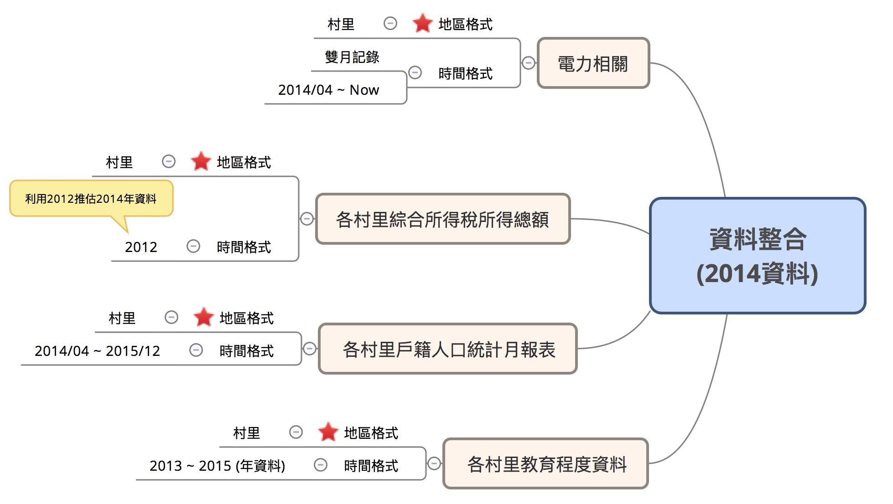

</div>

## 資料收集與整理 (3) {.data3}

將以下不同來源的資料按照村里進行串檔(JOIN)：

- [台電電力資料](http://www.taipower.com.tw/content/announcement/ann01.aspx)
- [各村里綜合所得稅所得總額](http://data.gov.tw/node/17983)
- [各村里戶籍人口統計月報表](http://data.gov.tw/node/8411)
- [各村里教育程度資料](http://data.gov.tw/node/8409)

> Note 1: 因為資料的時間涵蓋範圍不同，本研究取2014年進行分析(除所得資料未涵蓋，其他皆有）。

> Note 2: 將2012年的各村里綜合所得稅總和資料作為2014年的推估，與其他資料進行串檔。

# 群集分析

## 一句話形容群集分析？

<br><br><br><br><br>
<div align = 'center'>
<hh>近朱者赤，近墨者黑</hh>
</div>

## 為什麼我們需要群集分析？

將**人口特性**、**用電量**相似的村里合併

- 觀察**群**較觀察**值**容易
    - 如：**所得高**、**年齡層低**、**單身**、**女性**
- 描繪**群的輪廓**與用電量的關係

## 基本分群方法簡介

統計方法中常用的分群方法：

- Hierarchical Clustering
- Center-based Clustering
- Density-based Clustering

<div align="center">

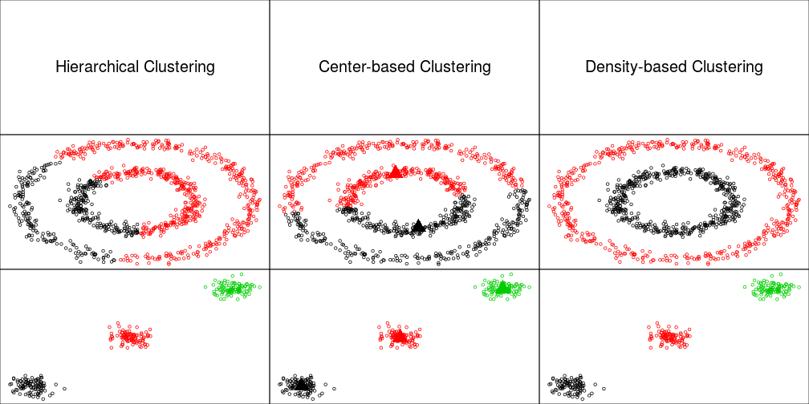

</div>

## 基本分群方法簡介

分群方法不是這次的課程目標 ~~請報名下次的課程~~

- 快速介紹本次所使用的[K-means分群方法](http://cgm.cs.ntust.edu.tw/etrex/kMeansClustering/kMeansClustering2.html)

- 若對分群方法有興趣，可以參考[Wush大大的神作](http://wush978.github.io/StatMLDM/slide/DataMining.html#22)


# 進階視覺化使用

---

<br><br><br><br><br>
<div align = 'center'>
<hh>空間資料視覺化！？</hh>
</div>

---

<div align="center">

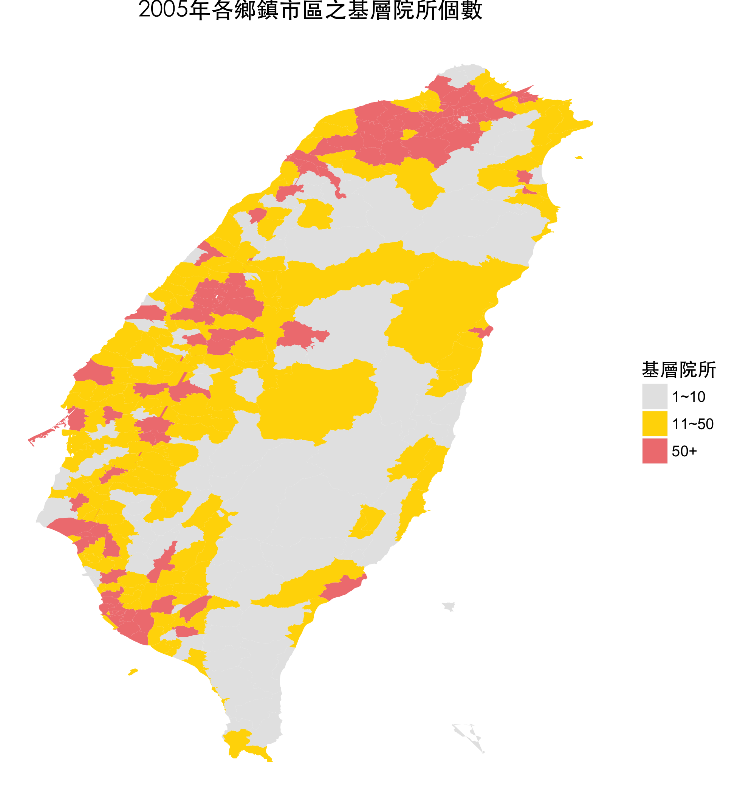

</div>

---

|縣市   |鄉鎮   |  診所個數|
|:------|:------|---------:|
|嘉義縣 |大林鎮 |  11|
|台北市 |中正區 |  70|
|台中市 |北屯區 | 120|
|桃園市 |桃園市 |   3|
|苗栗縣 |公館鄉 |   5|
|嘉義縣 |中埔鄉 |  14|

---

<div align = 'center'>
 <br>
<h1>好懂又漂亮多了，喜番～</h1>
</div>

## 空間資料視覺化時機

我們時常會遇到具有空間資訊(如經緯度)的資料，如：

- 台灣各縣市人口分布
- 台灣各縣市癌症發生率
- 國際航空熱門航班路線

具有空間性的資料，可以藉由地理視覺化觀察現象。

<h3>提供一個不一樣的角度探索資料</h3>

## Example

```{r, echo = F,eval = F}
'http://openflights.org/data.html'
knitr::kable(
  read.csv('https://raw.githubusercontent.com/jpatokal/openflights/master/data/routes.dat',
           col.names = c('Airline','Airline ID','Source airport','Source airport ID',
                         'Destination airport','Destination airport ID',
                         'Codeshare','stops','Equipment')) %>% 
    group_by(Source.airport,Destination.airport) %>% 
    tally %>% 
    arrange(desc(n)) %>% 
    ungroup %>% 
    sample_n(3)
    )
```

- Source.airport : 航程起點
- Destination.airport : 航程終點
- n : 往返次數

<div align = 'center'>
<h1>看的出方向性？位置？</h1>
</div>

<br>

|Source.airport |Destination.airport |  n  |
|:--------------|:-------------------|----:|
|SVX            |BKK                 |  26|
|XIY            |YTY                 |  12|
|CDG            |TPE                 |  59|

----

<br><br><br>
<div align="center">

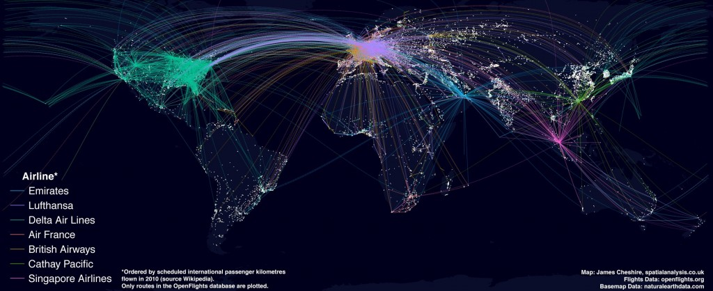

</div>

----

<br><br><br><br><br>
<div align = 'center'>
Q : 用什麼指標衡量用電量高低？<br>
<hh>台北市每戶用電量概況？</hh>
</div>

----

<div align="center">
- 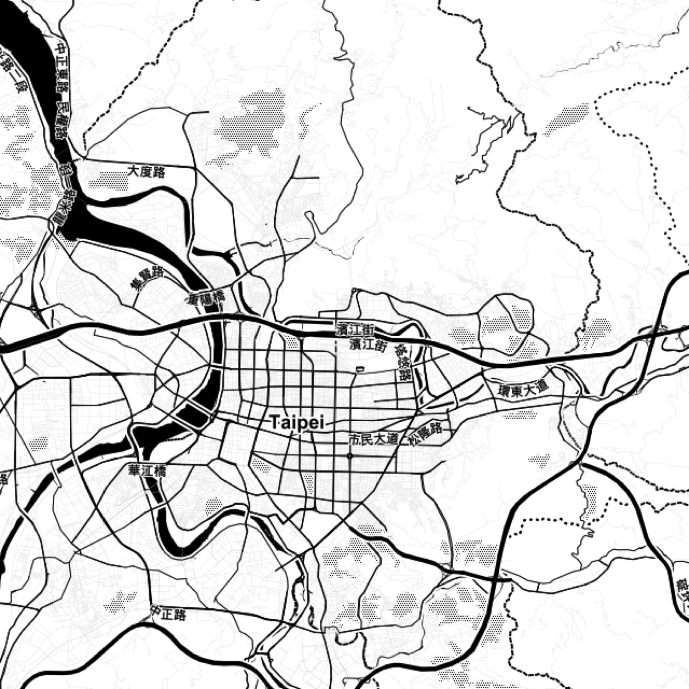 + 疊 + 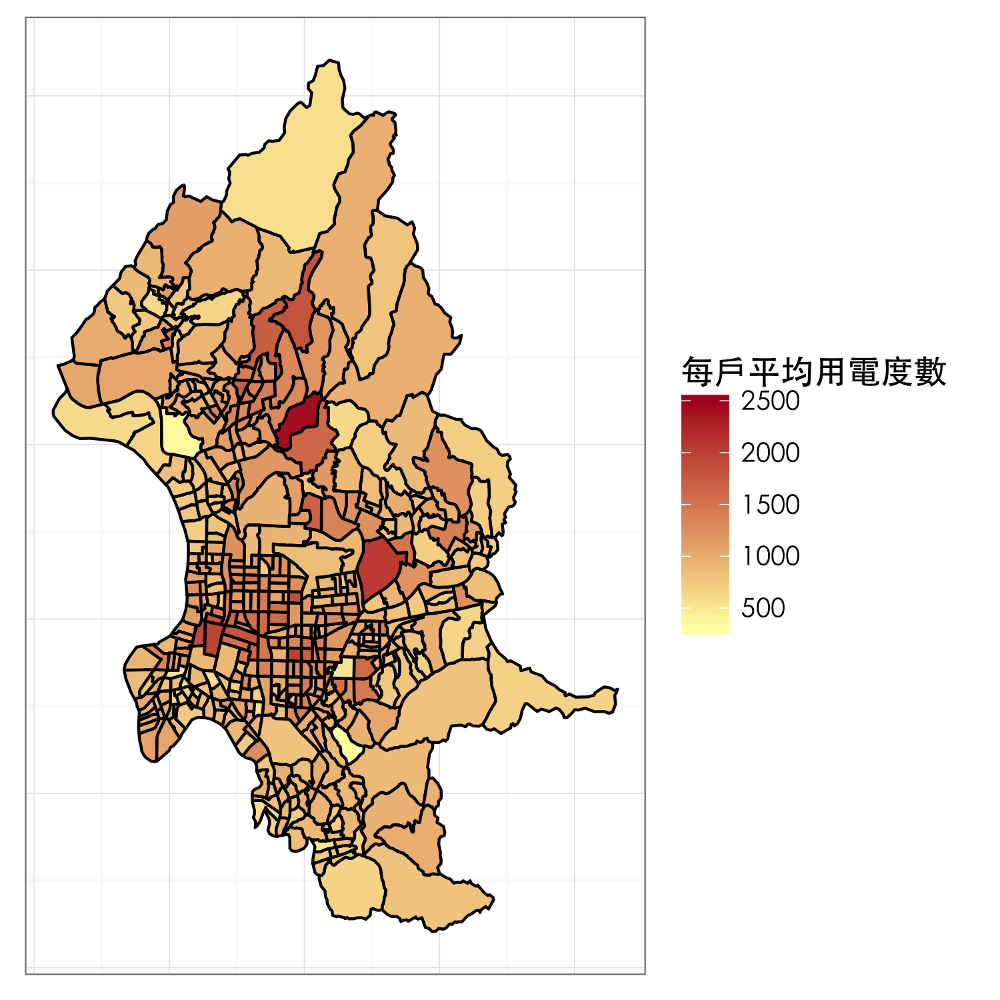
</div>

## ggmap 套件介紹與安裝

ggmap 套件是用來繪製地圖的R套件，地圖的來源可以由Google、OpenstreetMap等下載。

並且可以結合 ggplot 套件來**疊圖**

```{r,eval=F}
install.packages('ggmap')
```

## 首先，你需要有一張底圖

- `get_map` : 從 Google Map or Open Street Map(OSM) or .. 取得地圖
- `location` : 地圖的中心點, 可以放經緯度 or 地名
    - "政治大學""
    - c(lon = -95.3632715, lat = 29.7632836)
- `zoom`： 比例尺, 整數1~21

```{r }
library(ggmap)
```

```{r,fig.align='center',eval = F}
map <- get_map(location = c(121.546936,25.069758), zoom = 12, source = 'google', color = 'bw')
ggmap(ggmap = map)
## qmap(location=c(121.546936,25.069758), zoom=12, source = 'google', color = 'bw')
```

----

```{r,fig.align='center',eval = T, echo = F}
map <- get_map(location = c(121.546936,25.069758), zoom = 12, source = 'google', color = 'bw')
ggmap(ggmap = map)
## qmap(location=c(121.546936,25.069758), zoom=12, source = 'google', color = 'bw')
```


## 台灣村里界線圖整理

- [台灣村里界線圖下載](http://data.gov.tw/node/7438) 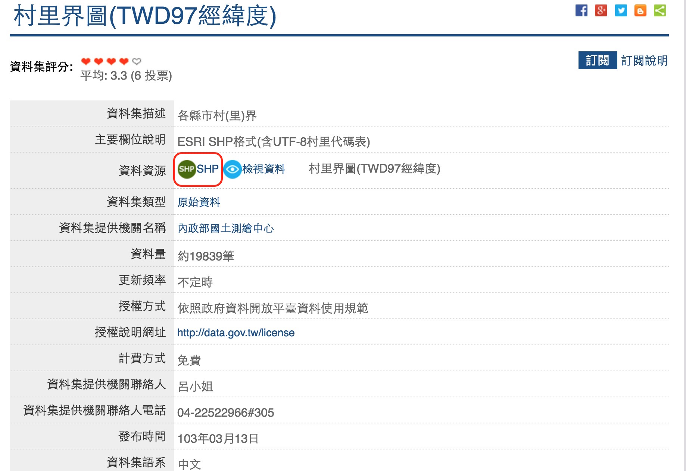
- 注意編碼(Mac版)：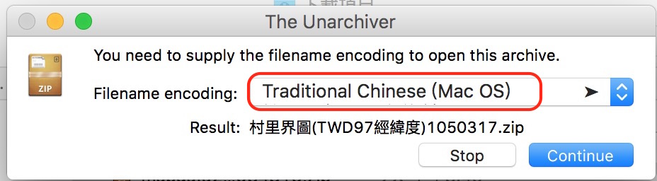

## 套件安裝

- 安裝`rgdal`、`rgeos`、`maptools`套件

```{r, eval = F}
install.packages('rgdal')
install.packages('maptools')
install.packages('rgeos')
```

## 台灣村里界線圖資料匯入

- sfn 格式為 `Large SpatialPolygon DataFrame`
- sfn有兩個重要的資料(要用`@`叫出來)
    - data 對應 `Village_NLSC_1050219.dbf` (縣市、鄉鎮、村里、及其ID)
    - polygon 對應 `Village_NLSC_1050219.shp` (用來描繪村里界線的資料)
- `?readOGR` 查詢一下細節
    - dsn : 放置台灣村里界線圖資料夾的路徑
    - layer : 資料夾內檔案名稱(不包含副檔名`.xxx`)

```{r, results = 'hide',echo = F}
library(rgdal)
library(maptools)
sfn <- readOGR(dsn = 'data/村里界圖(TWD97經緯度)1050317/',
               layer='Village_NLSC_1050219', stringsAsFactors = F)
```

```{r, results = 'hide', eval = F}
library(rgdal)
library(maptools)
library(ggplot2)
sfn <- readOGR(dsn = '..指定到下載下來檔案的路徑../村里界圖(TWD97經緯度)1050317/',
               layer='Village_NLSC_1050219', stringsAsFactors = F)
```

```{r,eval = F}
head(sfn@data)
sfn@polygons[[1]]
```

## 人生總是充滿挫折

其實玩OpenData一定會遇到許多奇形怪狀的問題

但不仿化挫折為契機！練習處理資料的能力

<div align="center">

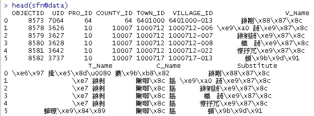

</div>

## 曙光！

如前幾天的課程，如果出現亂碼該怎麼做？ (encoding = ?)

```{r}
head(sfn@data)
```

## 僅取出台北的界線地圖

因為專案是針對台北市進行分析，因此我們只需要台北市的村里界線。

- `C_Name` : 為縣市名稱 
- `Substitute`與`V_Name`的差別？
    - Try : `sfn@data %>% filter(V_Name != Substitute) %>% head`
    - Ans : 村里名稱會因為中文編碼的關係無法顯示，`Substitute`為處理此問題後的欄位
- `fortify` : 按照`行政區域`(鄉鎮+村里欄位)將`Large SpatialPolygon DataFrame`轉換成繪圖的格式

```{r}
## 因為同一個縣市中會有相同名字的村里，為了避免Join出問題，建議加入鄉鎮名
sfn@data <- sfn@data %>% 
  mutate(行政區域 = paste0(T_Name,Substitute)) 
tp.v <- sfn[sfn$C_Name == '臺北市',] %>% fortify(region = '行政區域')
```

```{r, eval = F}
head(tp.v)
```

## 匯入整理過的電力資料

`windows版本不用更改fileEncoding`

- [20160426_data.csv下載位置](https://github.com/unityculture/DSP2016_DataCamp/tree/master/data)

```{r}
# 別忘了先檢查以下流程喔！ setwd() getwd() head() tail() str() ...
## Mac版本 
data <- read.csv('data/20160426_data.csv',fileEncoding = 'big-5')
tp.data <- data %>% filter(縣市 == '臺北市',統計年月 == '10407')
head(tp.data)
```

----

<br><br><br><br><br>
<div align = 'center'>
<hh>**練習時間！！(10 Mins)**</hh>
</div>

## 確認兩者資料的村里格式是否一致

`tp.data` 為取出符合`臺北市`、`104年07月`的資料(包含8月，雙月記錄)。

請試著確認:

**台北市用電量資料(tp.data)**與**台北市村里界線**的**村里欄位**是否一致？

也就是說，要檢查：

- 若台北市有456個村里，則tp.data與tp.v的村里都要有456個，且缺一不可
- `tp.data`與`tp.v`的村里的名稱要相同

## 參考答案

- 發現村里界線資料為`糖[部]里` ≠ 電力資料的`糖部里`

```{r}
## tp.v的村里名稱是否都有出現在tp.data中？ 若有，把位置記錄下來
posi <- which(! tp.v$id %in% tp.data$行政區域)
tp.v[posi,] %>% head(1)
## tp.data的村里名稱是否都有出現在tp.v中？ 若有，把位置記錄下來
posi <- which(! tp.data$行政區域 %in% tp.v$id)
tp.data[posi,'行政區域']
```

## 參考答案 Cont.

```{r}
## 發現除了糖部里，其他皆一致！
tp.v$id[tp.v$id == '萬華區糖[部]里'] <- '萬華區糖部里'
## 在確任一次有沒有不一樣
which(! tp.v$id %in% tp.data$行政區域)
which(! tp.data$行政區域 %in% tp.v$id)
```

## 將村里界線資料與電力資料合併

- 電力資料新增`村里`欄位。
- 僅挑選：(1)村里、(2)電力欄位 與村里界線資料合併即可

- 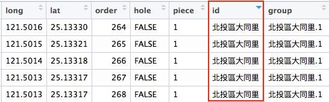 + **JOIN** + 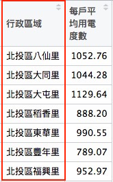

```{r}
## 電力資料
power_data <- tp.data %>% select(行政區域,每戶平均用電度數)
```

```{r,eval = F}
## 村里資料
tp.v
```

## 將村里界線資料與電力資料合併

```{r}
power_map <- tp.v %>% 
  merge(y = power_data, by.x = 'id', by.y = '行政區域')
power_map %>% head
```

## 終於可以畫圖啦！

用力哭泣！！！  T ... T

```{r,echo = F, fig.align= 'center'}
bg <- get_map(location=c(121.546936,25.069758), zoom=12, maptype = "toner")
ggmap(bg, extent = "device") +
  geom_polygon(data=power_map, aes(x = long, y = lat, group = group, fill=每戶平均用電度數),
               colour = "black", size = 0.5) +
  scale_fill_gradient(low = "#FFFFB2", high = "#B10026",
                      limits = c(300, 2500)) +
  theme_bw(base_family = 'STHeiti') + 
  theme(axis.text = element_blank(), ## 移除經緯度
        axis.ticks = element_blank(),
        axis.title = element_blank())
```

-----

- `geom_polygon` 會將相同`group`的`long`、`lat` 按照order連接起來
- `fill` : polygon的連接起來內部的顏色的深淺，會依照fill的大小來調整
- `scale_fill_gradient` : fill顏色的相關設定
    - low : fill最小值要填什麼顏色
    - high : fill最大值要填什麼顏色
    - limit : fill的範圍限制
    - [顏色色碼參考](https://www.nceas.ucsb.edu/~frazier/RSpatialGuides/colorPaletteCheatsheet.pdf)

```{r,eval=F}
bg <- get_map(location = c(121.546936,25.069758), zoom = 12, maptype = "toner")
ggmap(bg, extent = "device") +
  geom_polygon(data = power_map, aes(x = long, y = lat, group = group, fill = 每戶平均用電度數),
               colour = "black", size = 0.5) +
  scale_fill_gradient(low = "#FFFFB2", high = "#B10026",
                      limits = c(300, 2500)) +
  theme_bw(base_family = 'STHeiti') + 
  theme(axis.text = element_blank(), ## 移除經緯度
        axis.ticks = element_blank())
```

# 練習時間！打鐵趁修(燒)

----

<br><br><br><br><br>
<div align = 'center'>
<hh>請每小組挑出台北市的任一個鄉鎮市區，繪製用電量地圖！</hh>
</div>

----

```{r,echo = F, fig.align='center'}
bg <- get_map(location = c(121.5377993,25.0291208), zoom = 13, maptype = "toner")
ggmap(bg, extent = "device") +
  geom_polygon(data = power_map %>% filter(substr(id,1,3)=='大安區'), 
               aes(x = long, y = lat, group = group, fill = 每戶平均用電度數),
               colour = "black", size = 0.5) +
  scale_fill_gradient(low = "#FFFFB2", high = "#B10026",
                      limits = c(300, 2500)) +
  theme_bw(base_family = 'STHeiti') + 
  theme(axis.text = element_blank(), ## 移除經緯度
        axis.ticks = element_blank())+
  labs(x = '', y = '')
```

---

```{r,eval = F}
bg <- get_map(location = c(121.5377993,25.0291208), zoom = 13, maptype = "toner")
ggmap(bg, extent = "device") +
  geom_polygon(data = power_map %>% filter(substr(id,1,3)=='大安區'), 
               aes(x = long, y = lat, group = group, fill = 每戶平均用電度數),
               colour = "black", size = 0.5) +
  scale_fill_gradient(low = "#FFFFB2", high = "#B10026",
                      limits = c(300, 2500)) +
  theme_bw(base_family = 'STHeiti') + 
  theme(axis.text = element_blank(), ## 移除經緯度
        axis.ticks = element_blank())+
  labs(x = '', y = '') ## 移除X跟Y的title
```


# 雷達圖

## 雷達圖

- 雷達圖使用時機
- 套件介紹、安裝
- 資料整理
- 圖表設計

## 雷達圖使用時機


```{r, echo = F}
radar.data <- read.csv('https://raw.githubusercontent.com/unityculture/DSP2016_DataCamp/master/data/20160613_Radar_plot.csv')
radar.data$mean <- rowMeans(radar.data[,-1])
c("#A6CEE3","#1F78B4","#B2DF8A","#33A02C","#FB9A99","#E31A1C","#FDBF6F","#FF7F00","#CAB2D6","#6A3D9A") -> col.raw
highchart() %>% 
  hc_chart(polar = TRUE, type = "line") %>% 
  hc_title(text = "第5群 - 單身小資女族") %>% 
  hc_xAxis(categories = c('女男比','平均教育程度','扶老比',
                          '有偶比例','每戶平均用電度數','綜合所得中位數'),
           tickmarkPlacement = 'on',
           lineWidth = 0) %>% 
  hc_yAxis(gridLineInterpolation = 'polygon',
           lineWidth = 0,
           min = 0, max = 1) %>% 
  hc_series(
    list(
      name = "第5群 - 單身小資女族",
      data = radar.data[,c(6)],
      pointPlacement = 'on',color=col.raw[5]),
    list(
      name = "各群平均",
      data = radar.data[,c(10)],
      pointPlacement = 'on',color='#474747')) -> rd
```


<div style='float:left;width:48%;'>

```{r,echo =F}
rd %>% 
  hc_chart(height = '400', width = '400')
```

</div>

<div style='float:left;width:48%;'>

<h3> Tips: </h3>

- 需要比較**群**的特性
    - 發現第五群相較於**整體**，女性比例高、綜合所得偏低、用電量高、有偶比例低
    - 這不就是單身小資女嗎！！？  --->   **輪廓**
    - 這群包含哪些里呢？ 
    - 
    
</div>

## 雷德圖：highcharter 套件

- [highcharter for R 官方](http://jkunst.com/highcharter/oldindex.html#introduction)
- 包含許多類型的圖
    - Line chart, Pie chart, Bar chart, Histogram, Radar chart
- 原身是**Javascrip**，**互動式**視覺化專用
    - 熟悉JavaScript會比較吃香
    - [參數設定查詢](http://api.highcharts.com/highcharts)
- 善用`help(..)`

套件安裝：

```{r,eval = F}
install.packages("highcharter")
```

## Highchart 基本架構

<div align = 'center'>
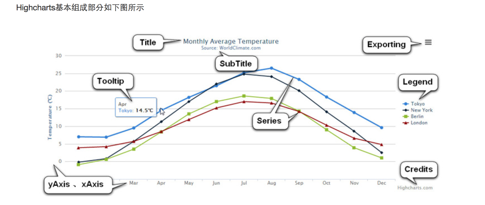
</div>

## Highchart 基本使用

感受Highchart繪圖方式：

- `highchart` : 建立一個Hihghchart, `?highchart`
- `hc_title` : 增加title
- `hc_add_series` : 通常擺放資料, ?hc_add_series
- `hc_xAxis` : X軸設定

```{r, eval = F}
## 試著漸層式執行以下程式碼
hc <- highchart()
hc
hc <- hc_title(hc, text = "A nice chart")
hc
hc <- hc_add_series(hc, data = c(7.0, 6.9, 9.5, 14.5, 18.2, 21.5, 25.2, 
                                26.5, 23.3, 18.3, 13.9, 9.6))
hc
```

# Highchart 練習時間 ！(5 mins)

## Highchart 基本練習

- 將上一頁的程式碼利用 `%>%` 進行改寫，一鼓作氣到底
- 加入副標題： `This is a subtitle` 
- 將`X軸`命名為`X Axis`、 `Y軸`命名為`Y Axis`。`help(hc_xAxis)`
- 在加入一條線，資料為: `c(6.9, 9.5, 14.5, 18.2, 21.5, 25.2, 26.5, 23.3, 18.3, 13.9, 9.6, 7.0)`

<div align = 'center'>

```{r,echo = F, fig.align = 'center'}
highchart() %>% 
  hc_title(text = 'A nice chart') %>% 
  hc_subtitle(text = 'This is a subtitle') %>% 
  hc_xAxis(title = list(text = 'X Axis')) %>% 
  hc_yAxis(title = list(text = 'Y Axis')) %>% 
  hc_add_series(data = c(7.0, 6.9, 9.5, 14.5, 18.2, 21.5, 25.2, 
                                26.5, 23.3, 18.3, 13.9, 9.6)) %>% 
  hc_add_series(data = c(6.9, 9.5, 14.5, 18.2, 21.5, 25.2, 
                             26.5, 23.3, 18.3, 13.9, 9.6,7.0 )) %>% 
  hc_chart(width = '300', height = '300')
```

</div>

---

```{r,eval = F}
highchart() %>% 
  hc_title(text = 'A nice chart') %>% 
  hc_subtitle(text = 'This is a subtitle') %>% 
  hc_xAxis(title = list(text = 'X Axis')) %>% 
  hc_yAxis(title = list(text = 'Y Axis')) %>% 
  hc_add_series(data = c(7.0, 6.9, 9.5, 14.5, 18.2, 21.5, 25.2, 
                                26.5, 23.3, 18.3, 13.9, 9.6)) %>% 
  hc_add_series(data = c(6.9, 9.5, 14.5, 18.2, 21.5, 25.2, 
                             26.5, 23.3, 18.3, 13.9, 9.6,7.0 ))
```

---

<br><br><br><br><br>
<div align = 'center'>
<hh>專案範例<br>運用Highchart描述各群**輪廓**</hh>
</div>

## 資料匯入

- 打開在瀏覽器上輸入下面網址，看看是什麼！？
- rowMeans : 計算列平均值。 後面會用到

```{r, message=F,eval=F}
## 別忘了先檢查以下流程喔！ setwd() getwd() head() tail() str() ...
data.url <- 'https://raw.githubusercontent.com/unityculture/DSP2016_DataCamp/master/data/20160613_Radar_plot.csv'
radar.data <- read.csv(file = data.url)
## 計算整理平均
radar.data$mean <- rowMeans(x = radar.data[,-1])
```

## 資料說明

- index : 人口特性指標
- X1 ~ X8 : 代表群1至群8
    - 每一里都會對應至某一群
    - 每一群包含的里數都不同
- 物以類聚

```{r,eval = F}
head(radar.data)
```

```{r,echo = F}
head(radar.data) %>% DT::datatable(class = 'compact') %>% DT::formatRound(2:10)
## radar.data %>% head
```

-----

- `polar = TRUE` : 雷達圖

```{r,eval=F}
hc <-
  highchart() %>% 
  hc_chart(polar = TRUE, type = "line") %>% 
  hc_title(text = "第5群 - 單身女小資女族") %>% 
  hc_xAxis(categories = c('女男比','平均教育程度','扶老比',
                          '有偶比例','每戶平均用電度數','綜合所得中位數'),
           tickmarkPlacement = 'on',
           lineWidth = 0) %>% 
  hc_yAxis(gridLineInterpolation = 'polygon',
           lineWidth = 0,
           min = 0, max = 1)
```

-----

- `col.raw` : 這些色碼可以怎麼得到呢？(RCcolorBrewer)
- `hc_series` : series設定

```{r,eval=F}
col.raw <- c("#A6CEE3","#1F78B4","#B2DF8A","#33A02C","#FB9A99",
             "#E31A1C","#FDBF6F","#FF7F00","#CAB2D6","#6A3D9A")
hc %>% 
  hc_series(
    list(
      name = "第1群 - 高所得已婚知識份子族群",
      data = radar.data[,c(6)],
      pointPlacement = 'on',color=col.raw[5]),
    list(
      name = "各群平均",
      data = radar.data[,c(10)],
      pointPlacement = 'on',color='#474747'))
```


# 互動式圖表：Plotly

----

<br><br><br><br><br>
<div align = 'center'>
<hh>專案範例：運用Plotly進行探索性資料分析</hh>
</div>

## 資料準備

```{r}
## 別忘了先檢查以下流程喔！ setwd() getwd() head() tail() str() ...
plotly_data <- 
  read.csv('https://raw.githubusercontent.com/unityculture/DSP2016_DataCamp/master/data/20160617_plotly_data.csv')
plotly_data %>% head
```

-----

<br><br><br><br><br>
<div align = 'center'>
<hh>問題：教育程度的地區，是否較有節電的概念呢？</hh>
</div>

-----

```{r,echo=F,fig.align='center'}
plotly_data %>% 
  ggplot(aes(x=平均教育程度,y=每戶平均用電度數))+
  geom_point(alpha=0.5,aes(text = paste('地區:',行政區域 )))+
  stat_smooth(method = 'lm',formula = y ~ x,se=F,size=0.5)+
  theme_bw(base_family = 'STHeiti')+
  theme(plot.title = element_text(size=rel(1.3)),
        axis.title.x = element_text(size = rel(2)),
        axis.title.y = element_text(size = rel(2))) -> p1
p1

```

-----

```{r,eval=F}
plotly_data %>% 
  ggplot(aes(x=平均教育程度,y=每戶平均用電度數))+
  geom_point(alpha=0.5,aes(text = paste('地區:',行政區域 )))+
  stat_smooth(method = 'lm',formula = y ~ x,se=F,size=0.5)+
  theme_bw(base_family = 'STHeiti')+
  theme(plot.title = element_text(size=rel(1.3)),
        axis.title.x = element_text(size = rel(2)),
        axis.title.y = element_text(size = rel(2))) -> p1
ggplotly(p1)
```

-----

<br><br><br><br><br>
<div align = 'center'>
<hh>分群分開來看呢？</hh>
</div>

------

```{r,echo=F,fig.align='center'}
plotly_data %>% 
  mutate(cluster = as.factor(cluster)) %>% 
  ggplot(aes(x=平均教育程度,y=每戶平均用電度數,group=cluster,colour=cluster))+
  geom_point(alpha=0.5,aes(text = paste('地區:',行政區域 )))+
  stat_smooth(method = 'lm',formula = y ~ x,se=F,size=0.5)+
  theme_bw(base_family = 'STHeiti')+
  theme(plot.title = element_text(size=rel(1.3)),
        axis.title.x = element_text(size = rel(2)),
        axis.title.y = element_text(size = rel(2))) -> p1
p1
## 請同學輸入：ggplotly(p1) 
```

-----

```{r,eval=F}
plotly_data %>% 
  mutate(cluster = as.factor(cluster)) %>% 
  ggplot(aes(x=平均教育程度,y=每戶平均用電度數,group=cluster,colour=cluster))+
  geom_point(alpha=0.5,aes(text = paste('地區:',行政區域 )))+
  stat_smooth(method = 'lm',formula = y ~ x,se=F,size=0.5)+
  theme_bw(base_family = 'STHeiti')+
  theme(plot.title = element_text(size=rel(1.3)),
        axis.title.x = element_text(size = rel(2)),
        axis.title.y = element_text(size = rel(2))) -> p1
ggplotly(p1)
```

----

<br><br><br><br><br>
<div align = 'center'>
<hh>Thank You!</hh>
</div>